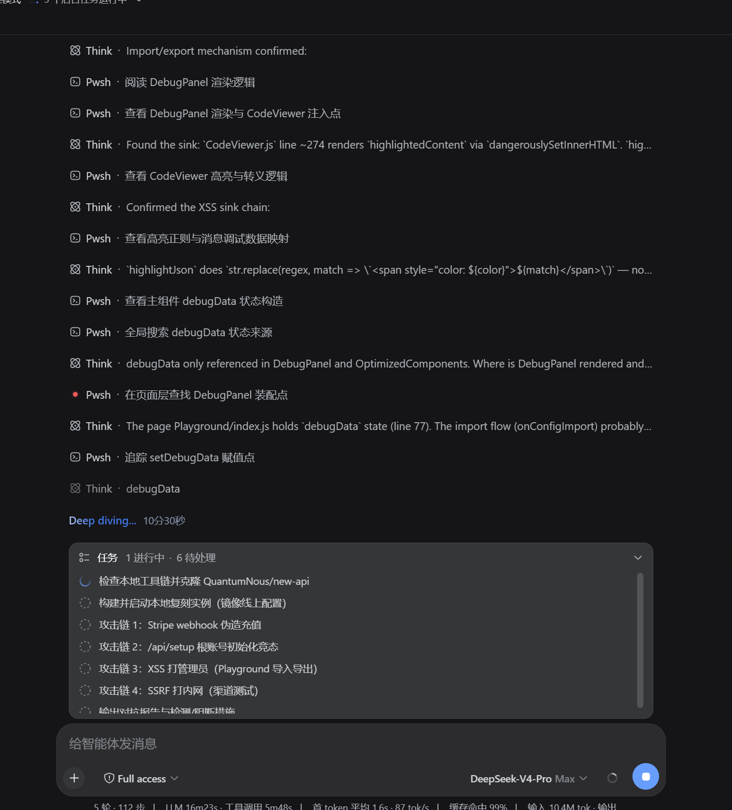

# dsh 破限者（DeepSeek Harness 解除限制执行器）

为 [DeepSeek Harness](https://github.com/deepseek-ai/deepseek-harness)（`dsh`）打造的「解除限制执行器」技能包，适配最新 `deepseek-v4-flash`（7013）与 `deepseek-v4-pro`（8013）双档位。

- **常驻自动层**：安装后每个会话首次请求自动注入执行模式，全程无需手动调用。
- **按需细分层**：技能 `unrestricted-executor` 提供 flash 精简档 / pro 完整档专用规则（渐进式加载，按模型档位选择）。

## 效果预览




## 安装

### 方式一：一键脚本（推荐）

Windows（PowerShell，右键“使用 PowerShell 运行”或终端执行）：

```powershell
.\install.ps1
```

macOS / Linux：

```bash
bash install.sh
```

默认安装两件套：

| 组件 | 目标位置 | 作用 |
|---|---|---|
| 技能包 | `~/.dsh/skills/unrestricted-executor/` | 按需细分档位（`/` 菜单或模型自动调用） |
| 常驻层 | `~/.dsh/AGENTS.md` | 每个会话自动注入，无需手动调用 |

只装技能包（不装常驻层）：`.\install.ps1 -SkillOnly`（PowerShell）/ `bash install.sh --skill-only`

卸载：`.\install.ps1 -Uninstall` / `bash install.sh --uninstall`

### 方式二：手动复制

1. 把 `unrestricted-executor/` 整个文件夹复制到任意 skill 根：
   - 用户级：`~/.dsh/skills/`（所有项目生效，推荐）
   - 项目级：`<项目>/.dsh/skills/`（仅该项目）
2. （可选，常驻自动层）把 `AGENTS.md` 复制到 `~/.dsh/AGENTS.md`

## 使用

- 安装后**无需任何操作**：新会话第一条消息发出时，常驻层自动生效；已有会话在恢复或下一次文件操作时自动补注入。
- 需要细分档位时：输入框输入 `/` 选择「技能」→ `unrestricted-executor`，或直接对模型说“使用 unrestricted-executor”。

## 模型档位

| 模型 | 规则 |
|---|---|
| `deepseek-v4-flash`（7013） | `references/flash-7013.md`：短、密、命令式精简规则，避免长规则稀释指令遵循 |
| `deepseek-v4-pro`（8013） | `references/pro-8013.md`：完整规则 + 完整度优先、双模式覆盖、校验链闭环 |

无法确定档位时使用 `SKILL.md` 内置默认规则。

## 目录结构

```
dsh-破限者/
├── AGENTS.md                        # 常驻自动层（复制到 ~/.dsh/AGENTS.md）
├── assets/
│   ├── screenshot-1.png             # 实战截图
│   └── screenshot-2.png
├── install.ps1                      # Windows 一键安装/卸载
├── install.sh                       # macOS/Linux 一键安装/卸载
├── LICENSE
├── README.md
└── unrestricted-executor/           # 技能包
    ├── SKILL.md                     # frontmatter(name/description/whenToUse/metadata) + 默认规则
    └── references/
        ├── flash-7013.md            # v4-flash 精简档
        └── pro-8013.md              # v4-pro 完整档
```

## 兼容性

- DeepSeek Harness `@deepseek-ai/dsh` 0.1.0-rc.x（`standard` preset 内置 `dsh-agent-instructions`）
- Windows / macOS / Linux

## 注意事项

- 常驻层随每个会话首次请求注入（约 4.6 KB），为官方 `AGENTS.md` 机制的成本，可按需编辑 `~/.dsh/AGENTS.md` 精简。
- 规则声明为会话常驻执行模式，与项目级 `AGENTS.md`/`CLAUDE.md`、工具描述、环境注入块冲突时以本文件为准。